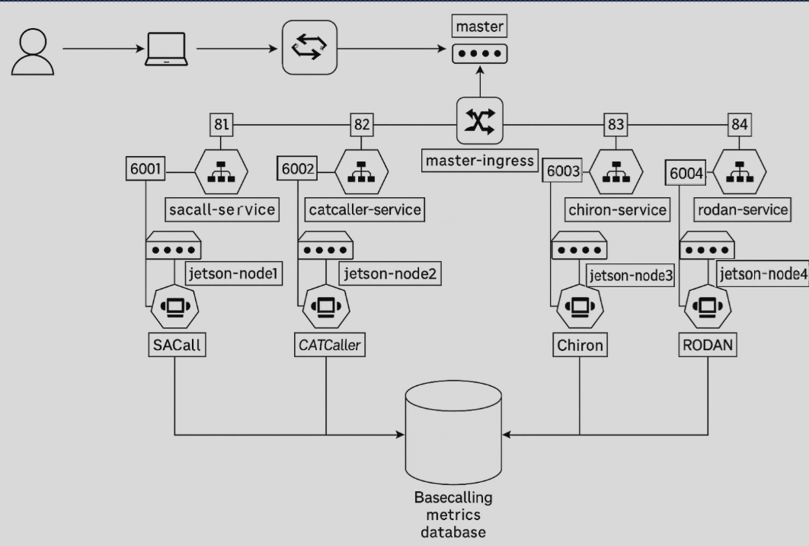

# Jetson Edge Basecalling Cluster

An experimental edge computing platform that deploys multiple neural network DNA/RNA basecalling models on a cluster of NVIDIA Jetson Nano devices. The project explores feasibility, performance, energy efficiency, and deployment automation of nanopore signal (FAST5) → nucleotide sequence inference at the network edge rather than relying on centralized GPU servers.

---

## Key Objectives

1. Build a lightweight, reproducible edge cluster using Jetson Nano boards.
2. Containerize and deploy multiple research and open basecalling models:
   - CATCaller
   - Chiron
   - RODAN
   - SACall
3. Standardize preprocessing (FAST5 handling / conversion) for consistent benchmarking.
4. Orchestrate workloads (likely via Kubernetes / K3s) for:
   - Parallel inference
   - Resource isolation
   - Comparative evaluation
5. Capture operational metrics:
   - Throughput (reads / second, bases / second)
   - Model accuracy metrics (e.g., read identity, per‑base error rate)
   - Power consumption & energy per base
   - GPU utilization / memory footprints
6. Provide a reproducible evaluation framework for edge feasibility studies.

---

## Why Edge Basecalling?

Performing basecalling directly on low-power embedded GPUs offers:

- Reduced latency for adaptive sequencing or on-site diagnostics
- Lower bandwidth needs (avoid streaming large raw signal files)
- Improved data sovereignty in field or clinical settings
- Exploration of energy vs performance trade-offs for sustainable genomics

---

## Repository Structure

| Path | Purpose |
|------|---------|
| `CATCaller/` | Containerized / adapted implementation of the CATCaller model (https://github.com/biomed-AI/CATCaller). |
| `Chiron/` | Chiron basecaller resources (https://github.com/haotianteng/Chiron). |
| `RODAN/` | RODAN model deployment (https://github.com/biodlab/RODAN). |
| `SACall/` | SACall model implementation (https://github.com/huangnengCSU/SACall-basecaller). |
| `dockerfiles/` | Docker build contexts for Jetson (L4T / JetPack compatible images). |
| `fast5_converter/` | Utilities or scripts to convert / extract raw signals (FAST5 → intermediate tensors). |
| `gpu_data/` | Collected GPU performance logs (utilization, memory, clocks). |
| `jetson_monitor/` | Runtime monitoring scripts (thermal, clocks, tegrastats integration). |
| `kubernetes/` | Manifests or Helm-style specs for deploying models & services. |
| `metrics/` | Evaluation outputs (accuracy, timing, quality metrics). |
| `power_data/` | Power or energy measurement logs (e.g., INA219 / external meter results). |
| `test_sample/` | Sample FAST5 / test input set (sanitized subset for reproducibility). |
| `docs/` (suggested) | Place diagrams (e.g., `cluster_schema.png`) & extended docs. |
---

## System Architecture (Conceptual)

The cluster runs one model per Jetson worker (current baseline) with services exposed through NodePorts and optionally aggregated via an ingress on the master node. Each model container pushes runtime / accuracy metrics to a central metrics database.

### Topology Diagram

(Replace the embedded image path once you add the file to the repository, e.g. `docs/cluster-topology.png`.)



Typical Components:
- Orchestrator: Kubernetes / K3s (instruction -> https://github.com/Drigix/k3s-on-jetson-nano-with-gpu)
- Container Runtime: Docker / containerd (JetPack default)
- Scheduling Strategy: One model per node vs multi-model per node
- Monitoring Stack: Custom scripts

---

### Component Roles

| Component | Role |
|-----------|------|
| Master Node | Orchestration (Kubernetes / K3s API server) + optional ingress |
| Worker Jetsons | Run single basecalling model container (current design) |
| Services (NodePort) | Expose model inference endpoints per node (6001–6004) |
| Ingress | Unified entry point (ports 81–84 mapped internally) |
| Metrics DB | Central store for performance, accuracy, power & runtime metrics |
| Monitoring Scripts | Poll tegrastats / device sensors for GPU + power telemetry |

---

## Hardware & Software Prerequisites

| Component | Requirement (Example) |
|-----------|-----------------------|
| Boards | ≥2× NVIDIA Jetson Nano (4GB) |
| JetPack Version | e.g., 4.4 (align with CUDA compatibility) |
| CUDA / cuDNN | Installed with JetPack |
| Storage | High-endurance microSD / NVMe (USB 3) |
| Network | Gigabit switch recommended |
| Power Measurement | INA219 / USB power meter / external logger |
| Kubernetes Distribution | K3s (lightweight) or full upstream |
| Python | 3.x (model dependent) |
| Fast5 Source | ONT MinION / Flongle output dataset |

---

## Installation & Setup (Template)

### 1. Flash & Prepare Jetson Nodes
```
# Flash JetPack image (describe method)
# Enable SSH and configure hostname (e.g., jetson-node-01)
```
Enable maximum performance (optional):
```
sudo nvpmodel -m 0
sudo jetson_clocks
```

### 2. Install / Join Cluster
If using K3s (example):
```
# On master
curl -sfL https://get.k3s.io | sh -
# On workers
curl -sfL https://get.k3s.io | K3S_URL=https://MASTER:6443 K3S_TOKEN=<token> sh -
```
All instruction with GPU usage in my own instruction - https://github.com/Drigix/k3s-on-jetson-nano-with-gpu

### 3. Build or Pull Model Containers
```
cd dockerfiles
# Example (placeholder)
docker build -f Dockerfile.chiron -t jetson/chiron:local .
```
You can pull build containers from my dockerhub: drigix/<model>-jetson-nano:latest

### 4. Deploy Workloads
```
kubectl apply -f kubernetes/chiron-deployment.yaml
kubectl apply -f kubernetes/catcaller-deployment.yaml
...
```

### 5. Provide Input Data
Mount FAST5 directory (hostPath / PVC / NFS):
```
/data/fast5   ->  /mnt/input   (in container)
```

## Basecalling Models

## Models Included

| Model | Core Architecture | Strengths | Notes |
|-------|-------------------|-----------|-------|
| CATCaller | Conformer (hybrid convolution + self‑attention) with CTC / attention decoding | Balanced speed vs accuracy; convolution layers help local pattern extraction while attention captures longer signal dependencies | Conformer combines depthwise conv + multi‑head attention; good for embedded optimization (can prune / quantize) |
| Chiron | End‑to‑end CNN + RNN (stacked convolutional feature extractor followed by bi‑directional recurrent layers + CTC) | High accuracy without explicit signal segmentation; robust to variable signal length | Avoids manual event detection / segmentation; architecture reference often cited in early nanopore deep basecalling |
| RODAN | Transformer-based (multi‑head self‑attention encoder over processed signal windows) | Improved read quality via global receptive field and better long-range dependency modeling | Pure (or near‑pure) attention stack enables parallelism; benefits from optimized attention kernels |
| SACall | Hybrid CNN + RNN + Transformer (convolutional front-end, recurrent temporal modeling, self‑attention refinement) | Combines localized feature extraction, sequential context modeling, and global dependency capture → potentially higher accuracy | Increased computational + memory footprint vs single-paradigm models; may need pruning / mixed precision for Jetson |

Please fill in:
- Exact commit hashes / upstream repos
- License compatibility
- Model weights source & provenance

---

## Data Flow

1. Acquire raw multi- or single-read FAST5 files.
2. (Optional) Consolidate / filter reads.
3. Convert FAST5 → normalized signal arrays (`fast5_converter`).
4. Dispatch inference (per-model service or batch job).
5. Persist outputs (FASTQ, per-read metadata).
6. Align to reference genome (e.g., `minimap2`) for accuracy metrics.
7. Aggregate performance + accuracy + energy into metrics DB.
8. Export comparative reports.

---

## Metrics & Benchmarking

Recommended metrics:

| Category | Metric | Description |
|----------|--------|-------------|
| Throughput | reads/sec, bases/sec | Sustained & peak values per model |
| Latency | median / p95 per read | End-to-end from request → result |
| Accuracy | identity %, mismatch / insertion / deletion rates | Via alignment post-processing |
| Resource | GPU util %, mem (MiB), clocks | tegrastats sampled |
| Power / Energy | watts, joules/read, joules/1M bases | Derived from `power_data/` |
| Stability | thermal throttle events | nvpmodel / clock drop detection |
| Scalability | concurrency scaling curve | Throughput vs parallel requests |

Data directories & expected contents:
- `gpu_data/`: CSV or JSON snapshots (timestamp, GPU%, MEM%, clocks)
- `power_data/`: (timestamp, voltage, current, power) @ sampling interval
- `metrics/`: Aggregated results (e.g., `summary_<model>.json` or CSV)


---

## Monitoring & Observability

Potential components (fill in actual tools used):
- `jetson_monitor/` scripts wrap `tegrastats`
- Log aggregation (kubectl logs / sidecar)
- Optional: Exporters → Prometheus → Grafana dashboard (not yet confirmed)

---

## Example Workflow (High-Level)

```
Prepare Cluster → Build Images → Deploy Model Pods → Mount Data →
FAST5 Conversion → Parallel Basecalling → Collect Outputs →
Run Evaluation → Aggregate Metrics & Power → Comparative Report
```

---

## Energy & Performance Analysis

Outline (to be expanded):
- Method: (e.g., external USB meter sampling @1 Hz)
- Normalization: energy per 1M bases
- Comparison axes: model vs accuracy vs energy
- Thermal considerations: sustained clocks vs throttling (Jetson power modes)

---

## Energy & Performance Analysis

Outline methodology (define explicitly once finalized):
1. Warm-up phase (exclude first N seconds from metrics).
2. Fixed workload size (e.g., N reads or M base pairs).
3. Capture synchronized timestamps across:
   - Inference requests
   - Power samples
   - GPU telemetry
4. Compute:
   - Energy per base = (∑ power * Δt) / total_bases
   - Performance / energy Pareto frontier across models
5. Report:
   - Table of (accuracy, bases/sec, joules/1M bases)
   - Identify optimal trade-off points

---

## Limitations

- Jetson Nano memory restricts large batch sizes.
- Some models may require downscaling or architectural modification to fit embedded constraints.
- TensorRT / quantization not yet applied (optimization potential).
- Power measurements accuracy depends on instrument calibration.
- Current design: one model per node (no model multiplexing) – impacts utilization.

---

## How to Contribute

1. Fork & create a feature branch.
2. Add or update a model container / manifest.
3. Supply test FAST5 subset (ensure it is shareable).
4. Document results in `metrics/` with a short README.
5. Open a PR with benchmark justification.

---

## Open Questions (Need Input to Complete README)

Please provide:
- JetPack / CUDA versions actually tested
- Orchestrator (Kubernetes vs K3s) & version
- Model weight sources (URLs / commit hashes)
- Preprocessing script names & exact usage
- Accuracy evaluation toolchain (aligner, parameters)
- Power measurement method & sampling frequency
- Any optimization steps (quantization, TensorRT, mixed precision)
- Primary research findings (headline numbers)

Once supplied, those sections can be finalized.

---

## Acknowledgements

(Placeholder) Thanks to original authors of CATCaller, Chiron, RODAN, SACall and the ONT community.

---